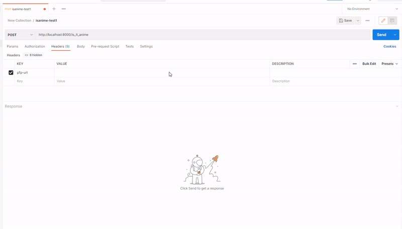
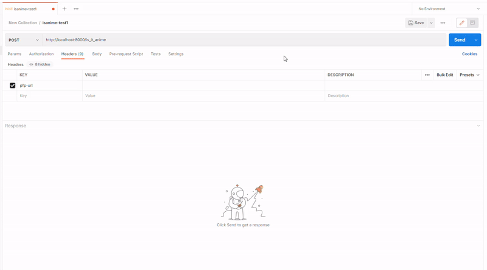

## Motivation

Once stumbled upon [this tweet](https://twitter.com/litavrinm/status/1527020571141320705) I decided to create a simple API that tells whether given image is anime or not.


## Tech stack

- Keras with all the underlying dependencies (Tensorflow, Scipy, PIL);
- FastAPI with Uvicorn web server.

## Usage guide

Send a POST request to `/is_it_anime` with the `pfp-url` header containing link to the image of interest. 

Possible responses:

- `200 { "conclusion": "Yes" }`
- `200 { "conclusion": "No" }`
- `400 { "details": "Error message..." }`
- `500 { "details": "Error message..." }`

## Demonstration

Trying out the API with [this image](https://pbs.twimg.com/media/D_jHn2fW4AAQlsz.jpg):



... and with an image from ['This person does not exist'](https://this-person-does-not-exist.com/en):



## Project file structure

Since pretty big part of the project files is gitingored here is a full presentation of it for context.

```
apime
│
├─ __init__.py
├─ .gitignore
├─ config.ini
├─ LICENSE
├─ pyvenv.cfg
├─ README.md
├─ requirements.txt
├─ __pycache__
│ ├── ...
│ ├── ...
│ └── ...
├─ .pytest_cache
│ ├── ...
│ ├── ...
│ └── ...
├─ bin                # Python interpreter stuff
│ ├── ...
│ ├── ...
│ └── ...
├─ data               # Images for training and validation the model  
│ ├── train
│ │  ├── anime
│ │  │  ├── ...
│ │  │  ├── ...
│ │  │  └── ...
│ │  └── random
│ │     ├── ...
│ │     ├── ...
│ │     └── ...
│ └── validation
│ │  ├── anime
│ │  │  ├── ...
│ │  │  ├── ...
│ │  │  └── ...
│ │  └── random
│ │     ├── ...
│ │     ├── ...
│ │     └── ...
├─ files_for_readme
│ └── the_tweet.jpg
├─ lib                # Python interpreter stuff
│ ├── ...
│ ├── ...
│ └── ...
├─ models             # Stores generated .h5 models
│ ├── ...
│ ├── ...
│ └── ...
└─ src
  ├── __pycache__
  │     ├── ...
  │     ├── ...
  │     └── ...
  ├── .pytest_cache
  │     ├── ...
  │     ├── ...
  │     └── ...
  ├── __init__.py
  ├── server.py
  ├── test_server.py
  └── utils.py
```

## Development notes

 - Run server: 

`.../apime$ uvicorn src.server:app --port 5000 --reload --reload-exclude bin/* --reload-exclude lib/* -reload-exclude *.html`

- Generate Keras model: 

`.../apime$ python src/utils.py generate-model <output_file_name>`

- Download random inages: 

`.../apime$ python src/utils.py download-random-images <how_much> <target_folder>`

- Feed the test images into the model and see results:

`python src/utils.py get-model-statistics`

- Run tests:

`.../apime$ pytest --ignore=bin --ignore=lib`

- Send request from commnad line:

```
curl -XPOST -H \
'pfp-url: <url>' \
'http://localhost:5000/is_it_anime'
```

## Deployment notes

SSH into an EC2 instance:

`ssh -i "<key_file>" <public_dns_name>`

Install Python and pip:

`...`

Clone git repo:

`git clone https://github.com/v-spassky/apime.git`

Cd into the project folder:

`cd apime/`

Install dependencies:

`pip install -r requirements.txt`

Run server:

`uvicorn src.server:app --host 0.0.0.0 --port 5000`
